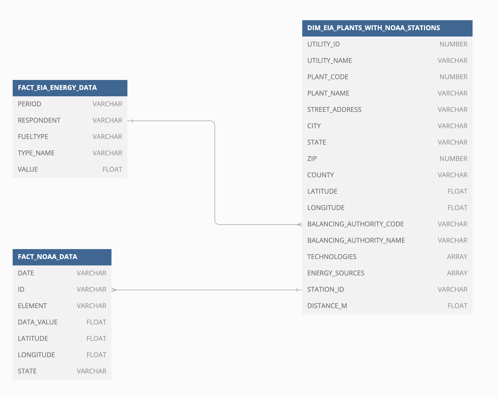
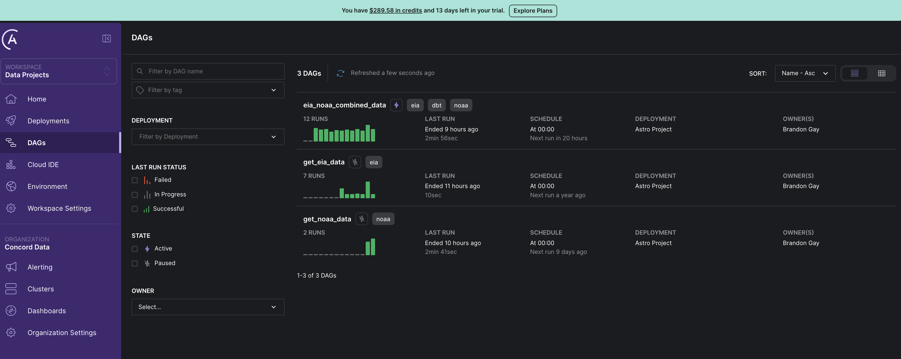
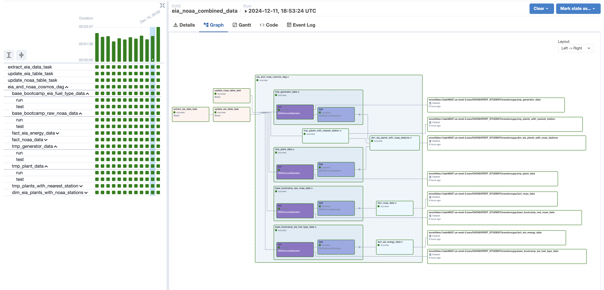
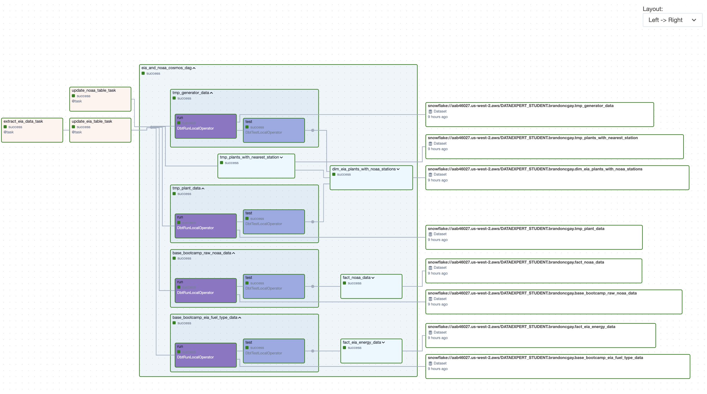
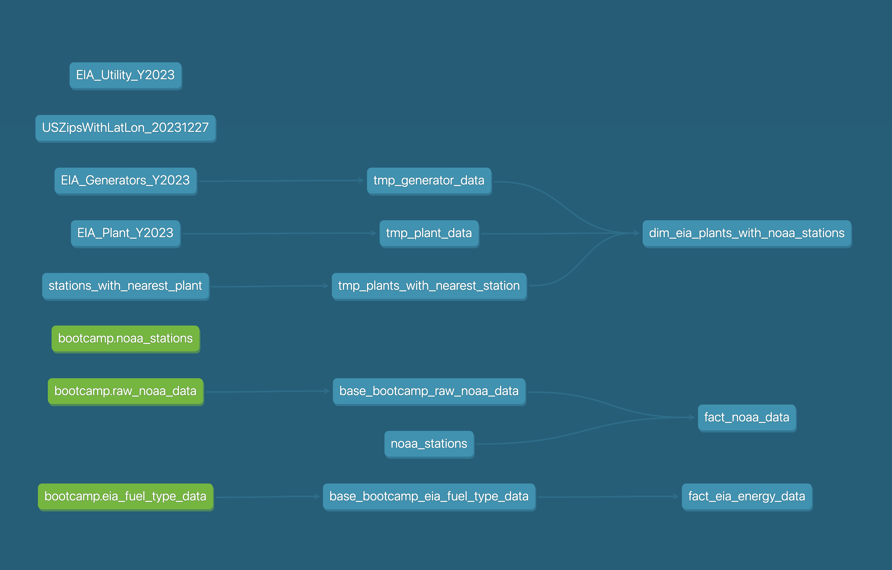
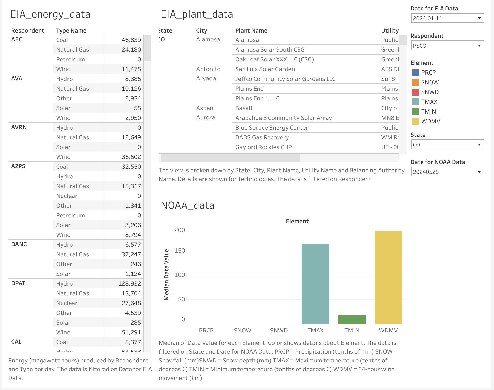

# EIA and NOAA data project

## Purpose and Scope
The goal of this project is to use open data to create a dashboard that will make it possible to explore the realationships between weather/climate and energy consumption/production.

## Data Sources
- Weather/Climate Data: NOAA Global Historical Climatology Network Daily (GHCN-D) via public S3 bucket https://github.com/awslabs/open-data-docs/tree/main/docs/noaa/noaa-ghcn

- Energy Data: US Energy Information Administration (eia.gov) via REST API

## Technology Stack
- Injestion: Snowpark was used to injest data from the public NOAA s3 bucket and from the eia.gov api into Snowflake.

- Storage: Snowflake is the landing spot for all of the raw NOAA and EIA data.

- Transformation and Testing: dbt is used to apply data quality checks to the raw data and transform it into the final fact and dim tables.

- Data Warehouse: Snowflake

- Orchestration and Monitoring: Airflow hosted on Astronomer is used to run and monitor the DAG.

- Visualization: Tableau connected to Snowflake is used for dashboarding.

### Metrics and Quality Checks
All metrics and data tests are documented in dbt.

### Challenges:

One of the biggest challenges was finding a way to relate noaa weather stations to eia powerplants. I finally found a python package called geopandas that I was able to use to measured the distance between each weather station and powerplant using their respective (lat, lon) measurements. Then I was able to filter to find the closest weather station to each powerplant. 

### Future Enhancements:

1. Much more polish on the dashboard (this project is coming in hot!)

2. Used GIS and mapping to create an interactive map with power and weather stations

3. Include some time series analysis and forecast modeling

### ERD for the final fact and dim tables
Full documention for all tables and columns is in the dbt docs.

### Cloud deployment on my Astronomer free trial

### Diagrams of the DAG from Airflow UI

### Diagram of the dbt models

### The EIA and NOAA Dashboard in Tableau

